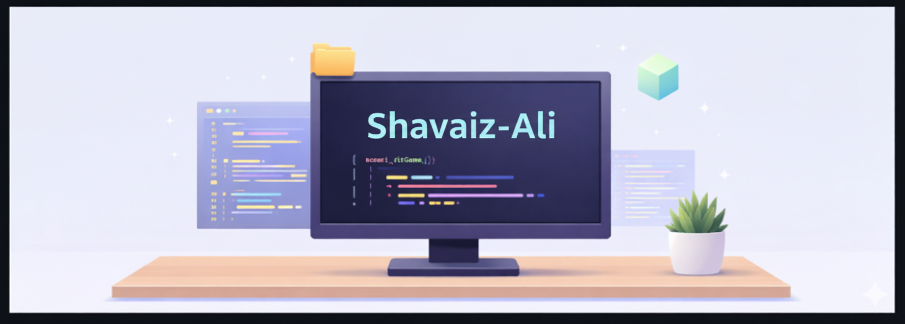

   

  <h3>Hi there 👋</h3>
  <h1>I'm <strong>Shavaiz Ali</strong></h1>

  

    💻 <strong>Full Stack Software Engineer</strong> specializing in <strong>TypeScript, React & Next.js</strong> 
    🧠 Building scalable dashboards, authentication systems, extensions, and API-driven applications 
    🚀 Focused on clean architecture, performance, and shipping real-world products
  

   

  

---

## 🚀 Primary Tech Stack

  
  
  
  
  
  
  

---

## 🧠 Skill Levels

**Advanced**
- TypeScript, JavaScript  
- React, Next.js  
- Node.js, Express  
- REST APIs, GraphQL  
- PostgreSQL, MongoDB, Prisma  
- Authentication (JWT)  

**Intermediate**
- Redis, Socket.io  
- AWS, GCP, Azure  
- Docker, Nginx  
- Angular  

**Familiar**
- Python  
- Shell Scripting  
- CI/CD workflows  

---

## 🧰 Languages & Tools

### ⚙️ Languages & Runtime

---

### ⚛️ Frontend & UI

---

### 🎨 Styling

---

### 🧩 Backend, APIs & Realtime

---

### 🗄️ Databases & ORM

---

### ☁️ Cloud & DevOps

---

### 🔧 Tooling & Version Control

---

## 📊 GitHub Activity

---

## 🐍 Contribution Snake

  

---

### 🔍 Keywords
Full Stack Developer · TypeScript · React · Next.js · Node.js · REST APIs · GraphQL · PostgreSQL · MongoDB · Prisma · JWT · AWS · Docker · Redis · SaaS Development
